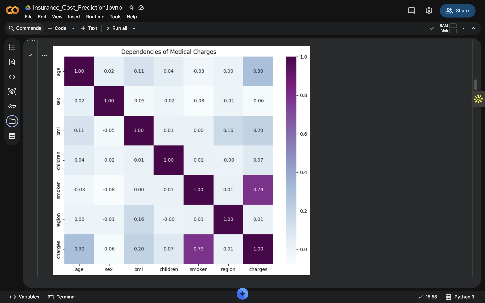
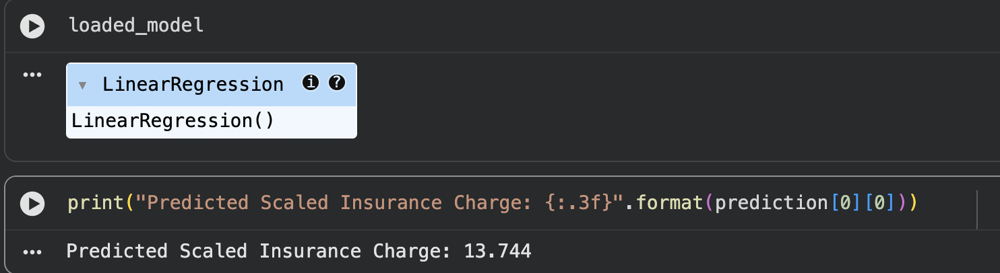

# Medical Cost Prediction using Machine Learning

## Project Overview

This project predicts individual medical insurance charges using Machine Learning regression models. The objective is to estimate a person's insurance cost based on demographic and health-related attributes such as age, BMI, smoking status, gender, region, and number of children.

The project includes data preprocessing, exploratory data analysis (EDA), feature scaling, model training, model evaluation, model comparison, and model serialization using Pickle.

---

## Problem Statement

Medical insurance companies estimate insurance premiums based on several personal and health-related factors. Manually estimating these costs can be time-consuming and inconsistent.

The objective of this project is to build a Machine Learning model capable of predicting medical insurance charges accurately using historical data.

---

## Dataset Information

The dataset contains **1,338 records** with the following features:

| Feature | Description |
|---------|-------------|
| Age | Age of the individual |
| Sex | Gender (Male/Female) |
| BMI | Body Mass Index |
| Children | Number of dependent children |
| Smoker | Smoking status |
| Region | Residential region |
| Charges | Medical insurance cost (Target Variable) |

---

## Project Workflow

- Data Loading
- Data Cleaning
- Categorical Data Encoding
- Exploratory Data Analysis (EDA)
- Correlation Analysis
- Feature Scaling
- Train-Test Split
- Linear Regression Model
- Ridge Regression Model
- Model Evaluation
- Model Comparison
- Model Serialization using Pickle
- Insurance Cost Prediction

---

## Exploratory Data Analysis

The dataset was analyzed using various visualization techniques to understand the relationship between different features and insurance charges.

### Correlation Heatmap



**Key Insights**

- Smoking status has the strongest influence on insurance charges.
- BMI and Age also significantly affect medical expenses.
- Gender, Region, and Number of Children have comparatively lower impact.

---

## Machine Learning Models

The following regression models were implemented:

- Linear Regression
- Ridge Regression

---

## Model Evaluation Metrics

The models were evaluated using:

- R² Score
- Root Mean Squared Error (RMSE)
- 10-Fold Cross Validation

### Model Comparison


---

## Best Performing Model

Based on the evaluation metrics, the model with the higher R² Score and lower RMSE was selected and saved using the Pickle library for future predictions.

---

## Model Prediction

The trained model can predict medical insurance charges for new individuals without retraining.

Example Prediction:



---

## Technologies Used

- Python
- NumPy
- Pandas
- Matplotlib
- Seaborn
- Scikit-learn
- Jupyter Notebook
- Pickle

---

## Repository Structure

```
Medical-Cost-Prediction/
│
├── Medical_Cost_Prediction.ipynb
├── insurance.csv
├── insurance_model.pkl
├── requirements.txt
├── correlation_heatmap.png
├── model_comparison.png
├── prediction_example.png
└── README.md
```

---

## How to Run the Project

1. Clone the repository

```
git clone https://github.com/aaranya31/Medical-Cost-Prediction.git
```

2. Install the required libraries

```
pip install -r requirements.txt
```

3. Open the Jupyter Notebook

```
Medical_Cost_Prediction.ipynb
```

4. Run all cells to reproduce the results.

---

## Future Improvements

- Implement additional regression algorithms for comparison.
- Deploy the model using Flask or Streamlit.
- Improve prediction accuracy through feature engineering and hyperparameter tuning.
- Integrate the model into a web application for real-time insurance cost prediction.

---

## Author

**Aaranya**
